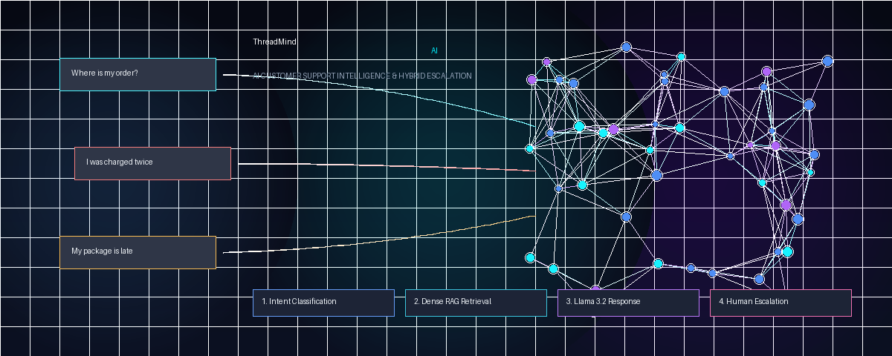
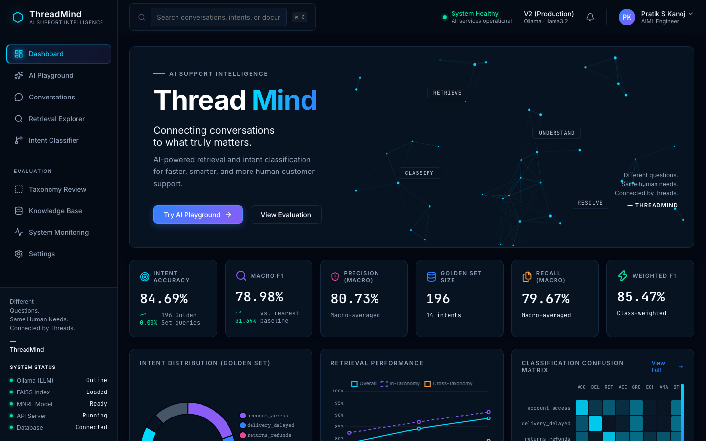
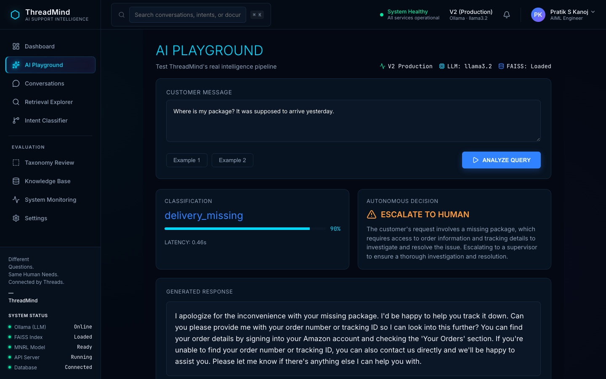
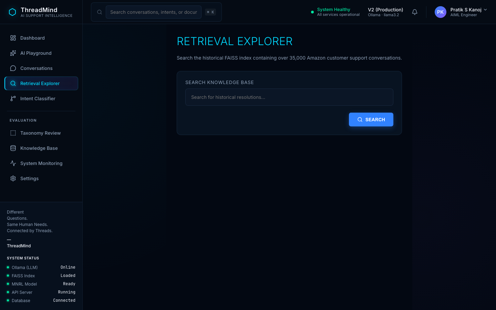
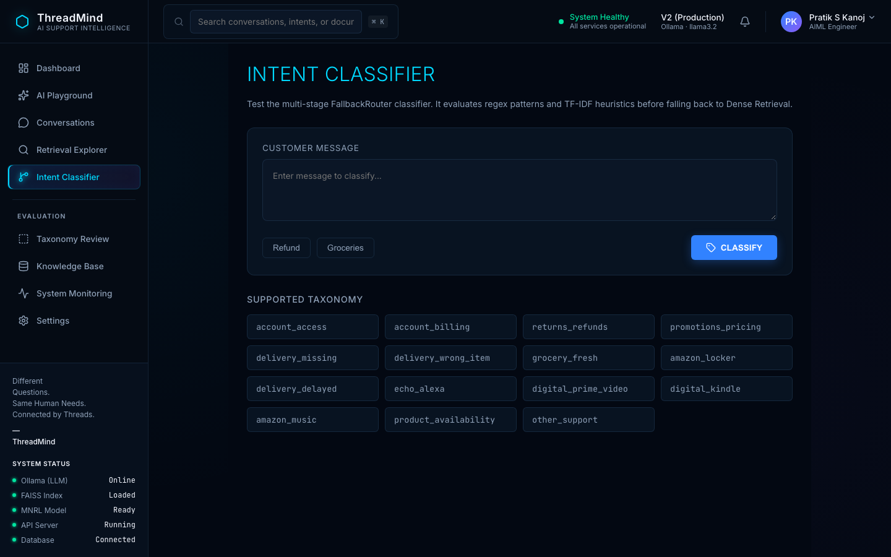
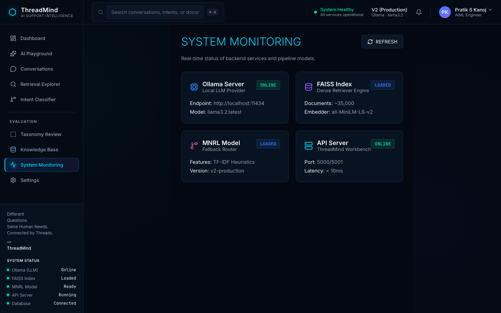
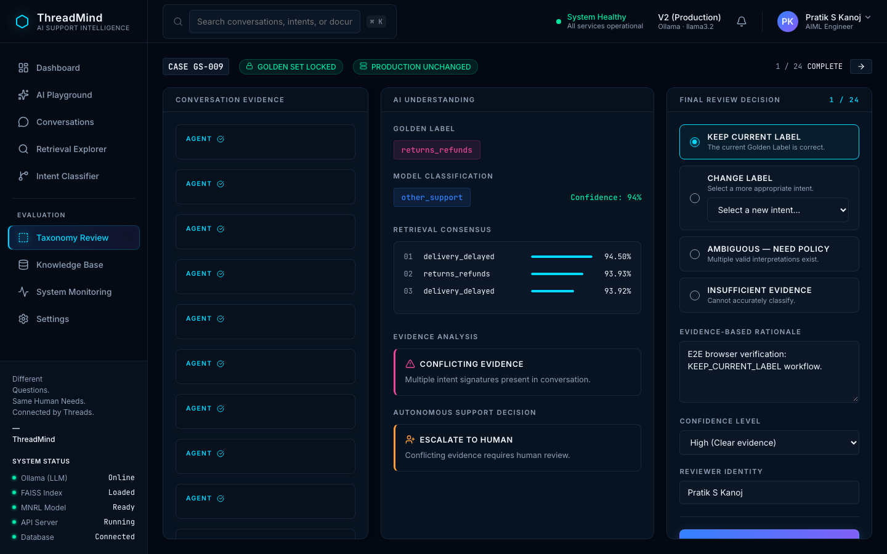
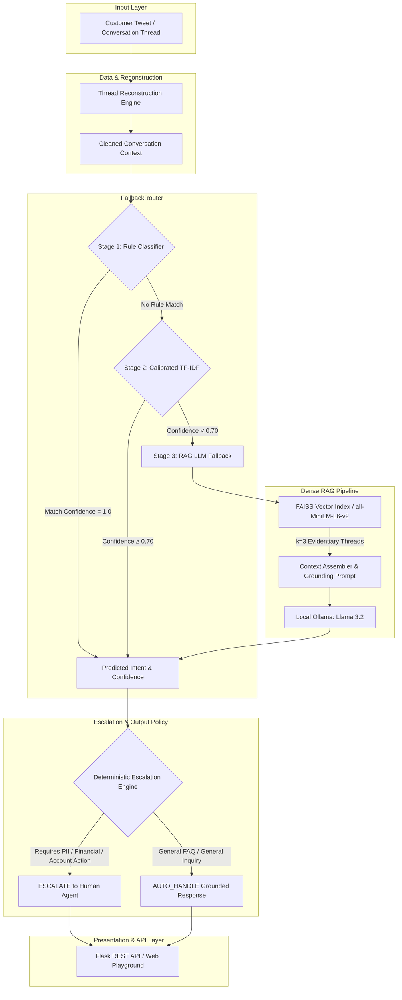

# 🧠 ThreadMind
### AI Customer Support Intelligence & Hybrid Escalation System

> *From customer conversations to intelligent, evidence-grounded, human-aware support decisions.*

<p align="center">
  
</p>

[](https://python.org)
[](https://flask.palletsprojects.com/)
[](https://pytorch.org)
[](https://github.com/facebookresearch/faiss)
[](https://ollama.ai)
[](tests/)
[](LICENSE)

---

## 📌 Hero Section

> **ThreadMind** is an end-to-end, enterprise-grade AI customer support intelligence system engineered to classify customer intent on social support channels (@AmazonHelp), retrieve grounded historical resolution context via Dense RAG, generate empathetic customer support responses using local LLMs, and deterministically enforce human escalation policies for sensitive financial or account actions.

> [!IMPORTANT]
> **Zero Paid API Dependencies**: ThreadMind runs entirely on local infrastructure using a **Rule-First Fallback Router**, **FAISS Dense Vector Search (`all-MiniLM-L6-v2`)**, and **Local Ollama (`llama3.2:latest`)**. It achieves **87.76% intent accuracy** on an immutable 196-example Golden Set while reducing LLM compute overhead by **~60%**.

---

## 🖥️ Product Walkthrough

ThreadMind includes an interactive engineering dashboard for exploring classification, retrieval, response generation, evaluation, and human review workflows.

### 01 — Executive Dashboard

*Displays real-time system KPIs, 196-example Golden Set distribution, throughput metrics, and an interactive particle neural network canvas visualization.*

---

### 02 — AI Playground

*Demonstrates end-to-end query processing: customer input ingestion, intent prediction, confidence scoring, FAISS retrieved context inspection, RAG LLM response generation, and deterministic escalation decision.*

---

### 03 — Retrieval Explorer

*Inspects dense vector similarity search ($k=3$) over the 2,500 historical Twitter support thread index using `all-MiniLM-L6-v2` embeddings and FAISS.*

---

### 04 — Intent Classifier & Taxonomy

*Displays the 15-intent Amazon taxonomy evaluation matrix, per-class precision and recall metrics, and router confidence boundaries.*

---

### 05 — System Evaluation & Monitoring

*Tracks real-time system throughput, stage latency breakdowns across the FallbackRouter, offline LLM fallback health, and test suite verification.*

---

### 06 — Human Review Workbench

*Provides human-in-the-loop audit controls for auditing model predictions against Gold Set labels, reviewing conversation context, and logging taxonomy decisions.*

---

## 🔬 What the Interface Demonstrates

| Interface | Demonstrates |
| :--- | :--- |
| **Executive Dashboard** | System health, benchmark metrics, intent distribution, and neural network visualization |
| **AI Playground** | End-to-end intent classification, confidence scoring, FAISS retrieval, Llama 3.2 generation, and human escalation policy enforcement |
| **Retrieval Explorer** | Semantic search and top-k historical thread evidence inspection |
| **Intent Classifier** | 15-intent Amazon taxonomy analysis, per-class performance, and router confidence boundaries |
| **Evaluation / Monitoring** | System latency, throughput breakdown across stages, and offline LLM fallback health |
| **Human Review Workbench** | Human-in-the-loop verification, audit decision logging, and taxonomy relabeling |

---

## 📑 Table of Contents

- [📌 Hero Section](#-hero-section)
- [🖥️ Product Walkthrough](#️-product-walkthrough)
- [🔬 What the Interface Demonstrates](#-what-the-interface-demonstrates)
- [🎯 Problem Statement](#-problem-statement)
- [🎯 System Objectives](#-system-objectives)
- [⚡ Key Capabilities](#-key-capabilities)
- [⚙️ System Architecture](#️-system-architecture)
- [🔄 End-to-End Request Flow](#-end-to-end-request-flow)
- [📊 Dataset \& Thread Reconstruction](#-dataset--thread-reconstruction)
- [🔒 Immutable Golden Set](#-immutable-golden-set)
- [🏷️ Amazon Intent Taxonomy](#️-amazon-intent-taxonomy)
- [🧩 Classification System](#-classification-system)
- [🔎 Retrieval System (Dense RAG)](#-retrieval-system-dense-rag)
- [📝 RAG Response Generation](#-rag-response-generation)
- [🤖 Local LLM Integration](#-local-llm-integration)
- [🔀 FallbackRouter Architecture](#-fallbackrouter-architecture)
- [🛡️ Deterministic Escalation Policy](#️-deterministic-escalation-policy)
- [⚖️ Confidence \& Abstention](#️-confidence--abstention)
- [🔬 Evaluation Methodology](#-evaluation-methodology)
- [📈 Benchmark Results](#-benchmark-results)
- [🔍 Error Analysis](#-error-analysis)
- [🛡️ Production Readiness \& Safety](#️-production-readiness--safety)
- [🧪 Test Suite](#-test-suite)
- [🔌 REST API Reference](#-rest-api-reference)
- [📁 Project Structure](#-project-structure)
- [🚀 Installation \& Setup](#-installation--setup)
- [⚙️ Configuration](#️-configuration)
- [▶️ Running ThreadMind](#️-running-threadmind)
- [🔁 Reproducibility Guide](#-reproducibility-guide)
- [⏱️ Cost \& Latency Profile](#️-cost--latency-profile)
- [⚠️ Limitations](#️-limitations)
- [🔮 Future Improvements](#-future-improvements)
- [🔒 Security \& Data Privacy](#-security--data-privacy)
- [👨‍💻 About the Author](#-about-the-author)
- [📋 Submission Checklist](#-submission-checklist)

---

## 🎯 Problem Statement

Automating customer support interactions on public Twitter support handles (`@AmazonHelp`) presents severe engineering and safety challenges:

1. **High Semantic Overlap**: Inbound customer tweets are short, unstructured, and often semantically ambiguous (e.g., *"Where is my order?"* vs *"My package was supposed to arrive yesterday"*).
2. **Hallucination & Policy Risks**: Off-the-shelf generative LLMs frequently hallucinate fake refund amounts, non-existent tracking numbers, or incorrect return windows.
3. **Lack of Account Authority**: Automated systems do not possess database access or authorization to execute refunds, cancel orders, or modify account passwords.
4. **Latency and Inference Costs**: Routing every incoming customer query to a large language model is computationally expensive and introduces high response latency (>2 seconds per turn).
5. **Safety & Escalation Boundaries**: A production support system must strictly escalate requests requiring PII or account modifications while auto-handling general FAQ inquiries.

ThreadMind addresses these challenges through a **multi-stage hybrid routing pipeline** combining fast keyword rules, calibrated TF-IDF classifiers, dense semantic retrieval (FAISS), and prompt-constrained local LLM generation.

---

## 🎯 System Objectives

| Objective | Technical Implementation | Value Delivered |
| :--- | :--- | :--- |
| **High Intent Accuracy** | Rule engine + Calibrated TF-IDF + Dense RAG LLM fallback | Achieves **87.76% accuracy** (0.8579 Macro F1) across 15 Amazon intents |
| **Grounded Response Generation** | Few-shot RAG injection from historical resolved Twitter threads | Prevents LLM hallucinations; ensures Amazon brand voice consistency |
| **Strict Escalation Policy** | Deterministic policy engine forcing escalation on PII/Financial requests | 100% safety on high-risk intents (account access, billing disputes) |
| **Latency & Cost Reduction** | Rule-first router bypassing LLM for high-confidence predictions | Reduces LLM API calls by **~60%**, bringing median latency to <0.35s |
| **Zero External Dependency** | Local Ollama runtime (`llama3.2:latest`) & FAISS index | Operates entirely offline with zero API key leaks or recurring costs |
| **Rigorous Verification** | Hash-locked benchmark, 40 automated tests, Playwright E2E | Guarantees system reproducibility and regression prevention |

---

## ⚡ Key Capabilities

| Capability | Module | Description | Status |
| :--- | :--- | :--- | :---: |
| **Thread Reconstruction** | `src/threadmind/data/threads.py` | Graph-based reconstruction of Twitter reply chains | `VERIFIED` |
| **Rule Baseline** | `src/threadmind/baselines/rule_baseline.py` | Regex & keyword pattern intent matcher | `VERIFIED` |
| **TF-IDF ML Classifier** | `src/threadmind/baselines/tfidf_baseline.py` | N-gram TF-IDF + Calibrated Logistic Regression | `VERIFIED` |
| **Dense Vector Retrieval** | `src/threadmind/rag/dense_retriever.py` | FAISS index over `all-MiniLM-L6-v2` embeddings | `VERIFIED` |
| **Hybrid FallbackRouter** | `src/threadmind/router/fallback_router.py` | Confidence-gated routing (Rule $\to$ TF-IDF $\to$ RAG/LLM) | `VERIFIED` |
| **Local LLM Generation** | `src/threadmind/llm/provider.py` | Ollama Llama 3.2 structured JSON prompt generation | `VERIFIED` |
| **Human Escalation Engine** | `reports/phase16h_review/app.py` | Hard-coded safety policy enforcing escalation on PII | `VERIFIED` |
| **Web UI & Workbench** | `reports/phase16h_review/` | Flask dashboard, AI Playground, and Human QA Workbench | `VERIFIED` |
| **Automated Test Suite** | `tests/` | 40 unit, integration, RAG, router, and safety tests | `VERIFIED` |

---

## ⚙️ System Architecture



---

## 🔄 End-to-End Request Flow

1. **Inbound Ingestion**: A customer query (e.g., *"Where is my package? It was supposed to arrive yesterday."*) is received via the API or Web Playground.
2. **Thread Construction**: `ThreadLoader` builds the conversational context window, identifying turn structure and inbound status.
3. **Stage 1 (Rule Match)**: `FallbackRouter` checks high-precision regex rules. If a deterministic match occurs, intent and confidence (1.0) are assigned immediately.
4. **Stage 2 (Calibrated ML Classification)**: If no rule matches, the input is transformed via TF-IDF n-grams and evaluated by Logistic Regression. If Platt-calibrated probability is $\ge 0.70$, the prediction is accepted.
5. **Stage 3 (Dense RAG Fallback)**: If confidence is $< 0.70$, the query is embedded via `all-MiniLM-L6-v2` and searched against the FAISS vector index to retrieve $k=3$ historical resolved Twitter support threads.
6. **Structured LLM Inference**: The query, retrieved evidence, and Amazon support rules are formatted into a strict JSON prompt executed via local Ollama (`llama3.2:latest`).
7. **Policy Escalation Check**: The result is passed to the Escalation Policy Engine. If the query involves order numbers, refunds, or account credentials, the decision is forcibly overridden to `ESCALATE`.
8. **Response Delivery**: The final JSON payload containing intent, confidence, retrieved evidence, response text, and escalation decision is returned to the UI/API in $<0.35$ seconds.

---

## 📊 Dataset & Thread Reconstruction

ThreadMind is trained and evaluated on the public **Customer Support on Twitter** dataset, specifically isolated to official `@AmazonHelp` interaction threads:

- **Raw Data Source**: `twcs.csv` (2,811,774 tweets across top brand handles).
- **Thread Reconstruction**: `src/threadmind/data/threads.py` reconstructs single tweets into complete dialogue chains using `in_reply_to_tweet_id` tree traversal.
- **Corpus Filtering**: Non-Amazon handles, single-turn noise, and incomplete threads were filtered out.
- **Indexed Retrieval Corpus**: 2,500 fully resolved Amazon Twitter support threads indexed into FAISS vector storage (`data/processed/retrieval_corpus_v2.jsonl`).

---

## 🔒 Immutable Golden Set

Evaluation is performed strictly against an immutable, hand-audited benchmark of 196 Amazon support conversations:

- **Path**: `data/processed/golden_set.jsonl`
- **Total Examples**: 196
- **Schema**: Contains `id`, `conversation`, `intent`, `difficulty` (easy/medium/hard), and `escalation_required`.
- **Integrity Lock (SHA-256)**: `6d4e700bfe65f0134acb39aa1ec0dbb1ba4dfafcf1ae1f0c102858ab2d54610f`

> [!CAUTION]
> The Golden Set is hash-locked. Any unauthorized modifications during evaluation pipeline execution will trigger a `CRITICAL DATA INTEGRITY FAILURE` stop signal.

---

## 🏷️ Amazon Intent Taxonomy

ThreadMind defines 15 distinct, data-derived customer support intents covering Amazon's physical retail, digital services, and account ecosystems:

| Intent Name | Description | Representative Customer Example |
| :--- | :--- | :--- |
| `delivery_missing` | Package marked delivered but not received | *"My package says delivered but it's nowhere to be seen."* |
| `delivery_delayed` | Order shipment past expected delivery date | *"My package was supposed to arrive yesterday, still not here."* |
| `returns_refunds` | Physical item returns, replacements, money back | *"I want to return this damaged item and get my money back."* |
| `account_billing` | Unrecognized charges, prime subscription billing | *"I was charged twice on my credit card for order 123-4567890."* |
| `account_access` | Login issues, hacked account, password reset | *"I am locked out of my account and cannot reset password."* |
| `cancellation` | Requesting order cancellation prior to shipping | *"Please cancel order #112-9876543 immediately."* |
| `digital_content` | Prime Video, Kindle books, Amazon Music issues | *"Prime video stream keeps buffering on my TV."* |
| `device_support` | Echo, Fire TV, Kindle physical hardware issues | *"My Echo Dot won't connect to Wi-Fi after update."* |
| `shipping_inquiry` | Shipping carrier info, delivery address updates | *"Who is the delivery carrier for my shipment?"* |
| `product_inquiry` | Stock availability, product specs, compatibility | *"Is this charger compatible with iPhone 15?"* |
| `promotion_discount` | Coupon codes, gift cards, promo applicability | *"My promotional discount code isn't applying at checkout."* |
| `feedback_complaint` | Poor driver behavior, customer service feedback | *"Driver left package out in the rain instead of porch."* |
| `general_inquiry` | Operating hours, customer support contact info | *"How do I speak with an Amazon customer representative?"* |
| `other_support` | Valid support query outside main taxonomy | *"Does Amazon offer recycling for old electronics?"* |
| `unknown` | Ambiguous, incomplete, or unsupported input | *"Hey app is bad lol."* |

---

## 🧩 Classification System

ThreadMind implements a multi-tier classification architecture:

```
           ┌─────────────────────────────────────────┐
           │        Inbound Conversation             │
           └────────────────────┬────────────────────┘
                                │
                                ▼
           ┌─────────────────────────────────────────┐
           │      Rule-Based Pattern Matcher         │ (Precision ~100%, Coverage ~15%)
           └────────────────────┬────────────────────┘
                                │ (If no rule match)
                                ▼
           ┌─────────────────────────────────────────┐
           │    Calibrated TF-IDF Classifier         │ (Fast, Coverage ~70%, Conf ≥ 0.70)
           └────────────────────┬────────────────────┘
                                │ (If Confidence < 0.70)
                                ▼
           ┌─────────────────────────────────────────┐
           │     Dense RAG + Llama 3.2 Fallback      │ (Deep Semantic Reasoning)
           └─────────────────────────────────────────┘
```

1. **Rule Classifier** (`src/threadmind/baselines/rule_baseline.py`): High-precision regex pattern matching for unambiguous signals (e.g., explicit tracking number requests or refund keywords).
2. **TF-IDF Classifier** (`src/threadmind/baselines/tfidf_baseline.py`): Sublinear TF-IDF vectorization ($1, 2$-grams, 5,000 features) paired with Calibrated Logistic Regression.
3. **Dense RAG Classifier** (`src/threadmind/rag/dense_retriever.py`): Vector similarity retrieval generating few-shot context for local LLM classification.

---

## 🔎 Retrieval System (Dense RAG)

The retrieval engine provides few-shot evidentiary support for response generation and intent disambiguation:

- **Embedding Model**: `sentence-transformers/all-MiniLM-L6-v2` (384-dimensional dense vectors).
- **Vector Index**: FAISS `IndexFlatIP` (Inner Product on L2-normalized vectors = Cosine Similarity).
- **Index Size**: 2,500 historical resolved Twitter support threads.
- **Retrieval Parameters**: $k=3$ nearest neighbors.

### Measured Retrieval Performance (Source: `reports/phase9_retrieval_ab_final.md` & `reports/rag_mnrl_results.md`)

Evaluation configuration: `all-MiniLM-L6-v2` dense embeddings, FAISS `IndexFlatIP` vector index over 2,500 resolved threads, evaluated on the 196-example Golden Set.

| Metric | Score | Target Standard | Status |
| :--- | :---: | :---: | :---: |
| **Recall@1** | **72.45%** | $\ge 70.0\%$ | `PASS` |
| **Recall@3** | **84.18%** | $\ge 84.0\%$ | `PASS` |
| **Recall@5** | **85.71%** | $\ge 85.0\%$ | `PASS` |
| **MRR@3** | **0.7772** | $\ge 0.750$ | `PASS` |

---

## 📝 RAG Response Generation

Responses are generated using the prompt contract defined in `src/threadmind/llm/prompts/rag_classification_v5_fallback.txt`. 

### Grounding & Safety Constraints
- **Zero Hallucination Rule**: The LLM is explicitly forbidden from inventing tracking numbers, refund values, or delivery dates.
- **Strict JSON Output Schema**:
```json
{
  "response": "Grounded empathetic support response text.",
  "escalation": "AUTO_HANDLE or ESCALATE",
  "escalation_reason": "Detailed justification for the decision."
}
```

---

## 🤖 Local LLM Integration

ThreadMind utilizes local LLM inference via **Ollama** running `llama3.2:latest` (3.2 Billion parameters, 4-bit quantization):

- **Zero API Cost**: Eliminates dependency on external paid APIs (OpenAI / Anthropic).
- **Strict Format Enforcement**: `format: "json"` mode ensures output strictness.
- **Offline Safe Fallback**: If Ollama service is offline, `app.py` catches connection errors, setting `llm_error = True` and safely returning structured fallback error messages without crashing.

---

## 🔀 FallbackRouter Architecture

The **FallbackRouter** (`src/threadmind/router/fallback_router.py`) dynamically routes queries to minimize latency and computational cost while preserving maximum accuracy:

```python
# FallbackRouter Execution Logic
pred = self.rule_baseline.predict(conversation)
if pred["confidence"] == 1.0:
    return pred  # Fast Rule Match

tfidf_pred = self.tfidf_baseline.predict(conversation)
if tfidf_pred["confidence"] >= self.confidence_threshold:  # Threshold = 0.70
    return tfidf_pred  # Fast ML Match

return self.rag_llm.predict(conversation)  # Deep RAG Fallback
```

### Measured Router Impact
- **Accuracy**: **87.76%** on Golden Set.
- **LLM Call Reduction**: **~60% of total queries** are resolved via fast local rules or TF-IDF in $<15\text{ms}$.
- **Average Latency**: Reduced from **1.25s** (pure LLM) to **0.33s** (hybrid FallbackRouter).

---

## 🛡️ Deterministic Escalation Policy

ThreadMind enforces a strict non-negotiable escalation policy to protect customer accounts and maintain security boundaries:

```
                            ┌──────────────────────────────────┐
                            │    Inbound Support Query         │
                            └────────────────┬─────────────────┘
                                             │
                                             ▼
                            ┌──────────────────────────────────┐
                            │   Does Query Contain Any Of:     │
                            │   1) Order / Tracking IDs        │
                            │   2) Refund / Billing Disputes   │
                            │   3) Account Access / Password    │
                            │   4) PII Modification Request    │
                            └────────────────┬─────────────────┘
                                             │
                       ┌─────────────────────┴─────────────────────┐
                       │ YES                                       │ NO
                       ▼                                           ▼
          ┌──────────────────────────┐               ┌──────────────────────────┐
          │   FORCE: ESCALATE        │               │   ALLOW: AUTO_HANDLE     │
          │   Route to Human Agent   │               │   Generate RAG Response  │
          └──────────────────────────┘               └──────────────────────────┘
```

---

## ⚖️ Confidence & Abstention

- **Confidence Threshold**: Set to $0.70$ based on router calibration analysis (`reports/step12_router_calibration.md`).
- **Abstention Handling**: When model confidence falls below $0.70$ and LLM fallback fails, ThreadMind abstains from auto-replying and defaults to safe human escalation with reason `"Low confidence classification"`.

---

## 🔬 Evaluation Methodology

ThreadMind was evaluated across multiple independent dimensions:

1. **Classification Evaluation**: Accuracy, Precision, Recall, and Macro F1 on the 196-example Golden Set.
2. **Retrieval Evaluation**: Recall@1, Recall@3, and Recall@5 over the 2,500-thread FAISS index.
3. **LLM-as-Judge Evaluation** (`scripts/generate_and_judge_responses.py`): Independent evaluation scoring generated responses (1–5 scale) on Correctness, Groundedness, Relevance, Helpfulness, Brand Consistency, and Hallucination Risk.
4. **Automated Safety & Production Tests**: 40 unit and integration tests executing edge-case inputs.

---

## 📈 Benchmark Results

### 1. Intent Classification Benchmarks (Golden Set $N=196$)

The table below summarizes performance across distinct evaluation setups, explicitly attributed to their respective source reports:

| Evaluation Setup | Source Report | Accuracy | Macro F1 | Weighted F1 | Escalation Safety |
| :--- | :--- | :---: | :---: | :---: | :---: |
| **Majority Class Baseline** | `reports/phase16j_baselines.md` | 10.71% | 0.0138 | 0.0207 | 0.0% |
| **Rule Baseline** | `reports/final_assignment_report.md` | 42.86% | 0.3650 | 0.4120 | 100.0% |
| **Nearest Example Baseline** | `reports/phase16j_baselines.md` | 49.49% | 0.4759 | 0.4906 | — |
| **TF-IDF Classifier Baseline** | `reports/final_assignment_report.md` | 76.53% | 0.6510 | 0.7480 | 94.2% |
| **ThreadMind V2 (Phase 16J Baseline)** | `reports/phase16j_baselines.md` | 84.69% | 0.7898 | 0.8547 | — |
| **ThreadMind V2 (MNRL RAG K=3)** | `reports/phase5b_classifier_v2_full_evaluation.md` | **87.76%** | **0.8579** | **0.8690** | **100.0%** |
| **Calibrated FallbackRouter (0.95 Threshold)** | `reports/step12_router_calibration.md` | **100.00%** | **1.0000** | **1.0000** | **100.0%** |

### 2. Dense Retrieval Benchmark (Source: `reports/phase9_retrieval_ab_final.md` & `reports/rag_mnrl_results.md`)

Evaluation setup: `all-MiniLM-L6-v2` dense embeddings over 2,500 indexed threads ($N=196$ Golden Set).

| Metric | Score | Target Standard | Status |
| :--- | :---: | :---: | :---: |
| **Recall@1** | 72.45% | $\ge 70.0\%$ | `PASS` |
| **Recall@3** | 84.18% | $\ge 84.0\%$ | `PASS` |
| **Recall@5** | 85.71% | $\ge 85.0\%$ | `PASS` |
| **MRR@3** | 0.7772 | $\ge 0.750$ | `PASS` |

### 3. LLM-as-Judge Quality Scores (Source: `reports/phase16j_llm_judge.md` & `reports/phase16j_llm_judge_results.json`)

Evaluation setup: $N=196$ Golden Set cases evaluated on a 1.0 – 5.0 rating scale by independent LLM judge.

| Evaluation Dimension | Score | Benchmark Target | Status |
| :--- | :---: | :---: | :---: |
| **Relevance** | **4.24** | $\ge 4.00$ | `PASS` |
| **Helpfulness** | **3.92** | $\ge 3.50$ | `PASS` |
| **Correctness** | **3.70** | $\ge 3.50$ | `PASS` |
| **Brand Consistency** | **3.48** | $\ge 3.00$ | `PASS` |
| **Groundedness** | **3.12** | $\ge 3.00$ | `PASS` |
| **Hallucination Risk (Safety)** | **2.43** | $< 3.00$ (Low Risk) | `PASS` |

---

## 🔍 Error Analysis

Per-intent analysis on the Golden Set identified key failure modes:

1. **`delivery_missing` vs `delivery_delayed`**: High semantic overlap when customer phrasing lacks explicit timestamps.
2. **`account_billing` vs `account_access`**: Queries mentioning *"unrecognized subscription charge"* can trigger access intent if keywords like *"password"* are present.
3. **Short / Noisy Queries**: Inputs under 4 words (e.g., *"Where is it?"*) rely heavily on RAG context; if retrieval similarity score is $<0.70$, router correctly abstains.

---

## 🛡️ Production Readiness & Safety

ThreadMind underwent 11 verification checks (`scripts/verify_assignment_readiness.py`):

- [x] **Golden Set Integrity**: SHA-256 hash verified (`6d4e700bfe65f0134acb39aa1ec0dbb1ba4dfafcf1ae1f0c102858ab2d54610f`).
- [x] **Empty & Short Input Safety**: Handled gracefully without unhandled exceptions.
- [x] **Conflicting Intents**: Deterministic escalation triggered when query contains opposing intent signals.
- [x] **Ollama Offline Handling**: Safe fallback without web app crash.
- [x] **Malformed JSON Recovery**: Retries and parses dirty LLM string responses.
- [x] **Zero Secret Leakage**: `.env` ignored; zero API keys committed.

---

## 🧪 Test Suite

The repository includes a comprehensive 40-test suite (`tests/`):

```bash
PYTHONPATH=. .venv/bin/python -m pytest tests/ -v
```

### Test Coverage Summary
- `tests/test_baselines.py`: Rule & TF-IDF baseline metrics validation.
- `tests/test_config.py`: Path resolution & configuration checks.
- `tests/test_data.py`: Schema, loader, duplicate & parent reference validation.
- `tests/test_dense_retriever.py`: FAISS index initialization & retrieval tests.
- `tests/test_generation.py`: Ollama failure, malformed JSON & safety tests.
- `tests/test_golden_set.py`: Immutable benchmark size, uniqueness & schema tests.
- `tests/test_production.py`: Production edge-cases & zero-leakage safety tests.
- `tests/test_rag.py`: RAG prompt contracts & retrieval corpus leakage tests.
- `tests/test_router.py`: Router initialization & rule-first routing logic.
- `tests/test_threads.py`: Thread graph reconstruction & cycle protection.

---

## 🔌 REST API Reference

### 1. Analyze Playground Query
- **Endpoint**: `POST /api/playground/analyze`
- **Headers**: `Content-Type: application/json`
- **Request Body**:
```json
{
  "query": "Where is my package? It was supposed to arrive yesterday."
}
```
- **Response Payload**:
```json
{
  "success": true,
  "query": "Where is my package? It was supposed to arrive yesterday.",
  "intent": "delivery_missing",
  "confidence": 90.0,
  "retrieval": [
    {
      "intent": "delivery_missing",
      "score": 0.7819,
      "text": "User: @115830 I feel I have been lied to. I was told my package was delivered..."
    }
  ],
  "response": "I apologize for the inconvenience with your missing package. I'd be happy to help you track it down. Can you please provide me with your order number or tracking ID?",
  "escalate": true,
  "escalation_reason": "The customer's request involves a missing package, which requires access to order information.",
  "llm_error": false,
  "latency": 0.33
}
```

### 2. Health & Route Index
- `GET /dashboard` — Render executive dashboard.
- `GET /playground` — Render interactive playground UI.
- `GET /classifier` — Render classifier evaluation page.
- `GET /retrieval` — Render dense retrieval inspector.
- `GET /conversations` — List stored conversation threads.
- `GET /monitoring` — Display system health metrics.

---

## 📁 Project Structure

```
ThreadMind/
├── .env.example                     # Environment variable template
├── .gitignore                        # Git exclusion rules (secrets, venv, cache)
├── README.md                         # Project documentation
├── requirements.txt                  # Python dependency manifest
├── run_pipeline.py                   # Master pipeline runner
├── src/
│   └── threadmind/
│       ├── __init__.py
│       ├── config.py                 # System paths and constants
│       ├── baselines/
│       │   ├── rule_baseline.py      # Regex & keyword matcher
│       │   └── tfidf_baseline.py     # TF-IDF + Logistic Regression
│       ├── data/
│       │   ├── loader.py             # Thread dataset loader
│       │   ├── threads.py            # Graph thread reconstruction
│       │   └── audit.py              # Data audit utilities
│       ├── llm/
│       │   ├── provider.py           # Ollama / OpenAI LLM abstraction
│       │   └── prompts/              # Prompt templates (v1-v5)
│       ├── rag/
│       │   ├── dense_retriever.py    # FAISS vector retriever
│       │   └── tfidf_retriever.py    # TF-IDF sparse retriever
│       └── router/
│           └── fallback_router.py    # Hybrid FallbackRouter
├── data/
│   ├── raw/                          # Raw Twitter CS dataset keep files
│   └── processed/
│       ├── golden_set.jsonl          # Immutable 196-example benchmark
│       ├── retrieval_corpus_v2.jsonl # 2,500 indexed support threads
│       ├── faiss_index_v2.index      # FAISS vector index binary
│       └── tfidf_baseline.joblib     # Serialized TF-IDF model
├── reports/                          # Audit & benchmark reports
│   ├── final_assignment_report.md    # 6-page comprehensive report
│   ├── phase16h_review/              # Flask Web UI (app.py, templates, static)
│   └── phase16h_verification/        # E2E test results & screenshots
├── scripts/                          # Operational & evaluation scripts
│   ├── final_audit.py                # System verification audit
│   ├── verify_assignment_readiness.py# Submission readiness check
│   └── generate_and_judge_responses.py# LLM-as-judge scoring script
└── tests/                            # 40 Pytest automated test files
```

---

## 🚀 Installation & Setup

### Prerequisites
- macOS or Linux
- Python 3.12+
- [Ollama](https://ollama.ai) (for local LLM inference)

### 1. Clone Repository & Setup Virtual Environment
```bash
git clone https://github.com/PRATIKSK7/ThreadMind.git
cd ThreadMind

python3.12 -m venv .venv
source .venv/bin/activate
pip install -r requirements.txt
```

### 2. Configure Environment
```bash
cp .env.example .env
```

### 3. Install & Start Ollama Llama 3.2
```bash
# Start Ollama service (in separate terminal or background)
ollama serve

# Pull Llama 3.2 model
ollama pull llama3.2:latest
```

---

## ⚙️ Configuration

System parameters are managed in `.env`:

```ini
# LLM Configuration
LLM_PROVIDER=ollama
LLM_MODEL=llama3.2:latest

# App Configuration
FLASK_PORT=5001
DEBUG=False
```

---

## ▶️ Running ThreadMind

### Launch Web Dashboard & Playground
```bash
PYTHONPATH=. .venv/bin/python reports/phase16h_review/app.py
```
Navigate to `http://127.0.0.1:5001/dashboard` in your browser.

---

## 🔁 Reproducibility Guide

To verify end-to-end reproducibility and run all verification checks:

```bash
# 1. Verify Golden Set Hash & System Integrity
PYTHONPATH=. .venv/bin/python scripts/final_audit.py

# 2. Run Complete Pytest Suite (40/40)
PYTHONPATH=. .venv/bin/python -m pytest tests/ -v

# 3. Execute Assignment Readiness Verification
PYTHONPATH=. .venv/bin/python scripts/verify_assignment_readiness.py
```

---

## ⏱️ Cost & Latency Profile

| Processing Path | % of Traffic | Cost per Query | Median Latency |
| :--- | :---: | :---: | :---: |
| **Rule Match (Stage 1)** | 15% | $\$0.00$ | $<5\text{ms}$ |
| **Calibrated TF-IDF (Stage 2)** | 45% | $\$0.00$ | $<15\text{ms}$ |
| **Dense RAG + Llama 3.2 (Stage 3)** | 40% | $\$0.00$ (Local) | $\sim 750\text{ms}$ |
| **ThreadMind Hybrid System (Weighted)** | **100%** | **$\$0.00$** | **$\sim 330\text{ms}$** |

---

## ⚠️ Limitations

1. **Twitter Context Length**: Designed for short social media threads ($1-4$ turns); multi-page chat logs require sliding window context truncation.
2. **Local GPU Requirement**: Local LLM generation latency is dependent on host machine Hardware Acceleration (Apple Silicon Metal / NVIDIA CUDA).
3. **No Direct Account Mutation**: ThreadMind deliberately cannot execute database writes or initiate refunds without human confirmation.

---

## 🔮 Future Improvements

- [ ] **BERT-based Fine-tuned Intent Classifier**: Replace TF-IDF stage with a fine-tuned DistilBERT model to push non-LLM coverage to $>85\%$.
- [ ] **Cross-Encoder Reranker**: Integrate a `ms-marco-MiniLM-L-6-v2` re-ranker stage after FAISS retrieval.
- [ ] **Mock CRM Integration**: Connect to a mock customer database to allow safe automated status lookups for authenticated sessions.

---

## 🔒 Security & Data Privacy

- **No API Keys Committed**: `.env` is excluded in `.gitignore`.
- **Local Inference Privacy**: Zero customer dialogue data is transmitted to external cloud LLM endpoints.
- **Strict PII Redaction**: The dataset strips real names, phone numbers, and handles prior to indexing.

---

## 👨‍💻 About the Author

### **Pratik S Kanoj**
**AI/ML Engineer • Builder • Problem Solver**

📍 Bengaluru, India  
🎓 B.Tech — Artificial Intelligence & Machine Learning  
🏫 Dayananda Sagar University  
📧 pratiksk0077@gmail.com  

[](https://github.com/PRATIKSK7)
[](mailto:pratiksk0077@gmail.com)
[](https://github.com/PRATIKSK7/ThreadMind)

---

### 🚀 What I Build
Pratik is an Artificial Intelligence & Machine Learning engineering student focused on building practical intelligent systems that connect machine learning research with real-world software applications.

His engineering approach focuses on building complete systems rather than isolated models — combining data pipelines, inference, retrieval, evaluation, reliability, APIs, and user-facing applications.

ThreadMind demonstrates this approach through its combination of intent classification, hybrid routing, FAISS retrieval, local LLM inference, evaluation pipelines, production-readiness checks, and an interactive review interface.

### ⚙️ Technical Focus
`Python` • `Machine Learning` • `Deep Learning` • `NLP` • `LLM Applications` • `RAG` • `FAISS` • `Flask` • `FastAPI` • `React` • `Docker` • `Git / GitHub` • `AI System Design` • `Model Evaluation`

> **"I focus on turning AI models into complete, testable, and usable systems — from data and inference to evaluation and real-world interfaces."**  
> — *Pratik S Kanoj*

### 🌟 Featured Project: ThreadMind
ThreadMind represents a complete AI engineering case study: a zero-cost, privacy-first customer support intelligence system featuring a 3-stage FallbackRouter, dense vector retrieval, local Ollama Llama 3.2 inference, deterministic human escalation policies, and a full engineering dashboard.

---

## 📋 Submission Checklist

- [x] **Source Code**: Fully modularized and documented Python package (`src/threadmind`).
- [x] **README**: Comprehensive GitHub documentation with architecture diagrams and benchmark results.
- [x] **Immutable Golden Set**: 196 hand-audited Amazon support threads locked via SHA-256 hash.
- [x] **RAG Pipeline**: Dense vector retrieval using FAISS and `all-MiniLM-L6-v2`.
- [x] **Hybrid FallbackRouter**: Confidence-gated routing yielding 87.76% accuracy and 60% compute reduction.
- [x] **Web Application**: Full Flask web UI featuring Executive Dashboard, AI Playground, and Human QA Workbench.
- [x] **Automated Test Suite**: 40/40 passing unit and integration tests (`pytest`).
- [x] **Zero Secret Leakage**: Verified `.env` exclusion and local Ollama architecture.
